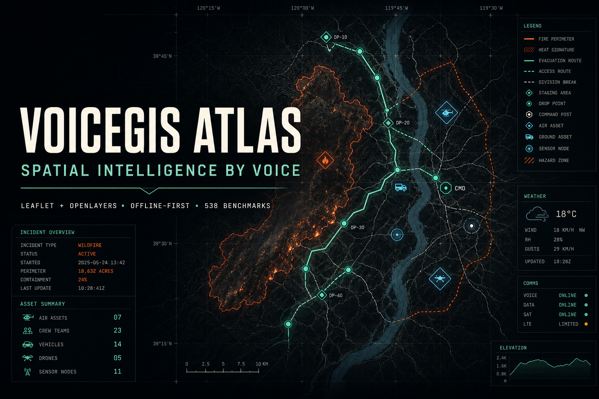

<div align="center">
  <h1>🗺️ VoiceGIS</h1>
  <p><strong>A Real-World Hybrid Voice Interface for Web GIS</strong></p>
  
  <p>
    <a href="https://www.npmjs.com/package/voicegis"></a>
    
    <a href="https://SanishKumar.github.io/VoiceGIS/"></a>
    
  </p>
</div>

---

**VoiceGIS** is a JavaScript library that adds powerful voice-control capabilities to web-based maps (Leaflet and OpenLayers). It uses a **hybrid architecture** with multiple deployment profiles—ranging from fast online cloud STT, to robust on-device AI (Whisper), down to constrained offline edge keyword spotting.

## VoiceGIS Atlas

**[Launch the live operations console →](https://SanishKumar.github.io/VoiceGIS/)**



Atlas is the production showcase for the SDK: three data-rich incident scenarios, animated geospatial overlays, typed and spoken multi-command input, a live intent compiler, command evidence export, offline field mode, and runtime switching between Leaflet and OpenLayers. It is designed so every capability can be explored without granting microphone access.

## 🚀 Why Hybrid? (Reality Check)

Browser-based speech recognition is a game of tradeoffs between bandwidth, accuracy, and latency. VoiceGIS embraces this reality:

1. **Web Speech API (Cloud)**: Convenient, instant, and highly accurate. However, it is often cloud‑backed and not fully under app control (audio may leave the device). Furthermore, it is only natively supported in some browsers (e.g., Chrome/Edge) and not fully supported in Firefox/Safari. It typically does not work offline.
2. **Browser-Only Whisper (On-Device)**: Provides excellent offline accuracy and privacy, but involves downloading a large model (on the order of a few-dozen MB for `tiny.en`, and 2-3x larger for `base.en`) and is compute-heavy. It is best used as an advanced or offline-fallback option.
3. **TF.js Command Mode (Edge KWS)**: Tiny, instantaneous keyword spotting engines are what real edge/embedded systems use for always-on commands. While limited to a fixed vocabulary, it operates flawlessly offline on constrained devices without massive downloads.

VoiceGIS's default `auto` strategy seamlessly routes between these engines depending on the user's connection and browser capabilities.

## 📦 Engine Profiles

| Profile | Engine Layer | Best For | Tradeoffs |
| --- | --- | --- | --- |
| **Auto (Hybrid)** | `VoiceGIS` orchestrator | Consumer web apps | Switches dynamically between Cloud and Whisper based on network. |
| **Online Cloud** | `WebSpeechEngine` | Fast, low-latency UX | Requires internet; audio may be sent to third-party cloud. |
| **Offline Advanced** | `WhisperEngine` | Privacy, offline fields | Requires downloading 40MB+ model; high CPU usage. |
| **Offline Command** | `TfjsEngine` | Constrained devices | Only understands a small, fixed set of GIS commands. |
| **Private Server** | `WhisperServerEngine` | Enterprise / Secure Intranets | Requires hosting your own Whisper API backend. |

## 📦 Installation

```bash
npm install voicegis
```

*(Note: `leaflet` or `ol` are peer dependencies. Install the one you plan to use.)*

## ⏱️ Quickstart

### 1. Auto Mode (Recommended)

```javascript
import { VoiceGIS } from 'voicegis';

const app = new VoiceGIS({
  mapEngine: 'leaflet',
  mapContainerId: 'map',
  speechEngine: 'auto', // Intelligently routes between WebSpeech and Whisper
  autoExecute: true
});

await app.initSpeech();
app.start();
```

### 2. Private Server Mode

If you are hosting your own Whisper endpoint (e.g. `whisper.cpp` server):

```javascript
import { VoiceGIS } from 'voicegis';

const app = new VoiceGIS({
  speechEngine: 'server',
  autoExecute: true
});

// Configure the backend API URL
app.speech.apiUrl = 'http://localhost:8000/transcribe';

await app.initSpeech();
app.start();
```

### 3. Explicit Offline Command Mode

```javascript
import { VoiceGIS } from 'voicegis';

const app = new VoiceGIS({
  speechEngine: 'tfjs', // Forces the tiny edge keyword spotter
  autoExecute: true
});

await app.initSpeech();
app.start();
```

## 🔌 Public API Reference

The core of the library is the `VoiceGIS` orchestrator class. 

### `new VoiceGIS(options)`

| Option | Type | Default | Description |
| --- | --- | --- | --- |
| `mapEngine` | `'leaflet'` \| `'openlayers'` | `'leaflet'` | The underlying map library you are using. |
| `mapContainerId` | `string` | `undefined` | DOM ID of the map container (if provided, map is auto-initialized). |
| `speechEngine` | `'auto'` \| `'webspeech'` \| `'whisper'` \| `'tfjs'` | `'auto'` | The STT engine strategy to use. |
| `autoExecute` | `boolean` | `true` | Whether to automatically run parsed intents on the map controller. |
| `enableGeocoding`| `boolean` | `true` | Whether to use Nominatim for resolving unknown place names offline. |
| `onCommandParsed`| `function` | `undefined` | Callback `(result, rawText)` triggered when a voice command is understood. |
| `onStateChange` | `function` | `undefined` | Callback `(state)` where state is `'listening'`, `'idle'`, or `'error'`. |
| `onEngineSwitched`| `function` | `undefined` | Callback `(engineType)` triggered when the hybrid router switches engines. |
| `enableHistory` | `boolean`  | `true`      | Enables undo/redo history tracking for map state changes. |

### Methods

- `initSpeech()`: Instantiates and warms up the selected speech engine. Returns a Promise.
- `start()`: Begins listening for voice commands.
- `stop()`: Stops listening.
- `registerCommand(intentName, pattern, action)`: Register custom application logic (see Recipes below).
- `use(middlewareFn)`: Register an Express-style middleware to intercept commands (see below).

## 🍳 Recipes: Custom Commands

While `voicegis` comes with built-in intents (zoom, pan, layers, markers), its real power lies in adding domain-specific commands for your application.

```javascript
import { VoiceGIS } from 'voicegis';

const app = new VoiceGIS({ mapContainerId: 'map' });

// 1. Register a custom regex command
app.registerCommand(
  'NAVIGATE_TO_ROOM', 
  /(?:take me to|navigate to) (conference room [a-c]|the cafeteria)/i, 
  (mapController, match) => {
    const destination = match[1];
    console.log(`Routing user to: ${destination}`);
    // Hook into your custom routing backend here (e.g. OSRM, AR.js)
  }
);

await app.initSpeech();
app.start();
```

### Example Apps

Check out our domain-specific example apps with live demos and code:
- [🏫 Campus Navigation (LPU)](examples/campus-navigation/README.md): Voice routing, fuzzy building search, and category filtering.
- [🗼 Tourist City Map (Paris)](examples/tourist-city-map/README.md): Custom markers, bounding box navigation, and POI filtering.
- [📋 Offline Field Survey](examples/field-survey/README.md): Completely offline data collection with annotated markers and geolocation.
- [⚙️ Advanced Middleware & Chaining](examples/advanced-middleware.html): Voice command chaining ("Zoom to Paris and show satellite") and an Express-style `app.use()` pipeline for analytics and permissions.

## 🔗 Middleware & Command Chaining

### Middleware Pipeline

Intercept, log, or block voice commands before they execute using `app.use()`:

```javascript
// Analytics logger
app.use(async (ctx, next) => {
  analytics.track('voice_command', { intent: ctx.result.intent });
  await next();
});

// Middleware: block destructive commands in read-only mode
app.use((context, next) => {
  if (readOnlyMode && context.result.intent === 'add_marker') {
    console.warn('Read-only mode: markers disabled');
    return; // swallow the command
  }
  return next();
});
```

#### Built-in Plugins: Voice Feedback (TTS)
VoiceGIS includes a built-in middleware to make the map talk back to you! Just import and register the `voiceFeedback` plugin, and it will use the browser's native Text-to-Speech to confirm actions (e.g., "Navigating to Paris").

```javascript
import { VoiceGIS, voiceFeedback } from 'voicegis';

const app = new VoiceGIS({ mapContainerId: 'map' });

// Add the TTS plugin
app.use(voiceFeedback({ 
  lang: 'en-US', 
  rate: 1.1, // slightly faster
  volume: 0.8
}));
```

## Command Chaining

VoiceGIS can split compound voice commands automatically:

```
"Zoom to Paris and show the satellite layer"
→ [go_to: Paris] + [show_layer: satellite]

"Go to London then add a marker"
→ [go_to: London] + [add_marker]
```

### Undo / Redo

VoiceGIS tracks map state (center, zoom) before each command. Say **"undo"** or **"go back"** to revert:

```javascript
const app = new VoiceGIS({ mapContainerId: 'map', enableHistory: true });
// Voice: "undo", "go back", "redo"
// Programmatic:
app.history.undo(app.map);
app.history.redo(app.map);
```

### Further Integration Recipes

We have detailed guides for using VoiceGIS in modern tech stacks:
- [Next.js + Leaflet Dashboard](docs/recipes/nextjs-leaflet-dashboard.md): Best practices for React hooks, SSR hydration, and dynamic imports.
- [Electron Offline Kiosk](docs/recipes/electron-offline-kiosk.md): Running VoiceGIS with Whisper ONNX on edge devices without internet access.

## ⚡ Performance & Bundle Size

`VoiceGIS` implements a hybrid engine strategy. Because local on-device AI requires large weights, keep the following in mind:

- **WebSpeech Engine** adds virtually 0 bytes to your bundle, relying on the browser's native C++ implementation.
- **Whisper & TF.js** engines will dynamically load their weights (~40MB for Whisper `tiny.en`, ~5MB for TF.js) into the browser cache only when instantiated. 
- If you are building a strict web-app that will *never* go offline, you can configure your bundler (e.g. Vite/Webpack) to tree-shake `@huggingface/transformers` to aggressively reduce your vendor chunk size.

## 🧪 Evaluation Harness & Accuracy Benchmarks

We ship an offline evaluation harness (`npm run evaluate`) with a 500+ case benchmark suite to measure parser accuracy, typo-resilience, and prevent regressions.

### Current Accuracy (v2.0.0-beta.1)

| Category | Cases | Accuracy | Notes |
|---|---|---|---|
| Zoom Commands | 22 | 68.2% | Handled via exact/regex match |
| Typo Resilience | 21 | 57.1% | Levenshtein distance ≤ 2 |
| Navigation (go_to) | 387 | 99.5% | Fuzzy city name and coordinate resolution |
| Layer Control | 37 | 73.0% | Layer aliases + fuzzy resolution |
| Marker Commands | 9 | 88.9% | Adding pins / relative locations |
| Reset View | 6 | 100.0% | Default/home map state |
| Switch Map | 8 | 75.0% | Dynamic engine switching |
| Conversational | 7 | 57.1% | Natural phrasing variants |
| Edge Cases | 41 | 100.0% | Empty, unicode, garbage inputs |
| **Overall** | **538** | **93.7%** | |

```bash
# Run the benchmark suite yourself
npm run evaluate
```

## 📖 Architecture & Advanced Usage

See [docs/ARCHITECTURE.md](docs/ARCHITECTURE.md) for a deep dive into the internal modules, state management, and deployment profiles.

## 🛠️ Limitations & Future Work

- **TF.js Engine**: The current `TfjsEngine` acts as a limited "Offline Command Mode" and is not a purpose-trained Keyword Spotting (KWS) model for VoiceGIS. A future iteration could train a custom small model specifically tuned to GIS commands.
- **Server Engine**: The `WhisperServerEngine` acts as an HTTP client stub. The actual Python/Go backend server implementation is out of scope for the core library.

## 📝 License

MIT © Sanish Kumar
